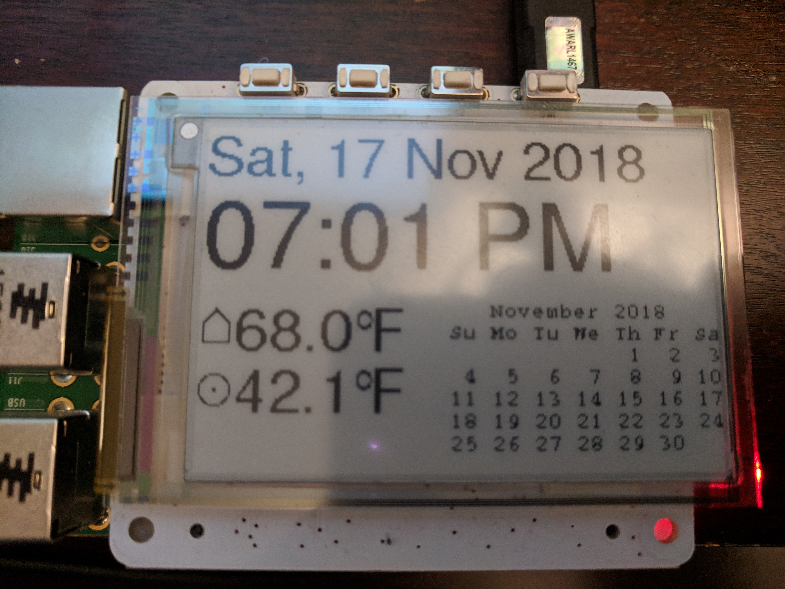

# Pightstand
## A raspberry-pi based nightstand clock

### Summary

A nightstand clock as a programming project.


[Link to original](https://photos.app.goo.gl/F47QVzqR2oV6EbBj6)


### Parts

#### Hardware

| Item | Note | Link |
| --- | --- | --- |
| raspberry pi | model B+ (40-pin); latest model (in link) is much more capable, same price  | [Adafruit](https://www.adafruit.com/product/3775) |
| PaPiRus Screen HAT | 2.7" screen, 4 buttons | [US](https://www.adafruit.com/product/3420) [UK](https://uk.pi-supply.com/products/papirus-epaper-eink-screen-hat-for-raspberry-pi) |
| microSD card | 16GB SanDisk (boot media) | [Amazon](https://smile.amazon.com/gp/product/B00M55BX3G) |
| USB WiFi adapter | Raspberry Pi official version; newer boards have embedded WiFi | [Amazon](https://smile.amazon.com/Official-Raspberry-Pi-WiFi-dongle/dp/B014HTNO52) |
| USB power supply | 5V 2A recommended | [Adafruit](https://www.adafruit.com/product/1995) |


#### Software

| Library | Link |
| --- | --- |
| PiSupply Papirus | [papirus](https://github.com/PiSupply/PaPiRus) |
| Python Imaging Library | [PIL](https://pillow.readthedocs.io/en/stable/) |
| Python API for WeMo | [pywemo](https://github.com/pavoni/pywemo) |
| Python client library for [3M50 Radio Thermostat](http://www.radiothermostat.com/filtrete/products/3M-50/) | [radiotherm](https://github.com/mhrivnak/radiotherm) |
| Python Requests library | native package ([online docs](https://2.python-requests.org/en/master/)) |


### Description

#### General Principles

+ write code in python
  + this is, among other things, a programming exercise
+ cache data from unreliable sources
  + connections to remote APIs are not guaranteed
  + when imaging the display, pull from cache
  + use separate routines to update cache
  + in this application, having old data is better than having no data
+ use in-memory filesystem (`/dev/shm`) for temporary files
  + prevent wear to fragile SD cards
  + reboots wipe this filesystem, and that's okay
+ use JSON to format data at rest
  + single standard format simplifies troubleshooting
  + yes, you can create JSON using shell scripts
+ create separate programs for each task (_a la_ microservices)
+ leverage OS-level tools (`bash`, `cron`, `cal`) where appropriate


#### papirus-temp

This is a shell script I wrote to read the on-board temperature sensor.  It provides the board temperature, which is regularly higher than the room temperature, and not much use in this project.  [Merged with the vendor repo](https://github.com/PiSupply/PaPiRus/blob/master/bin/papirus-temp.sh) (see history, below).  Since then, a python version has also been contributed.

#### papiswitch

This is a python program that monitors the buttons on the PaPiRus Screen HAT:

+  checks a PID file to make sure it's not already running
+  event loop waits for keypress
+  keypress is [de-bounced](https://www.arduino.cc/en/tutorial/debounce)
+  first detected [WeMo plug](https://www.belkin.com/us/p/P-F7C063/) is toggled
+  quits on error

A `cron` job launches this every minute.  While not perfect, works 90% of the time (when I push a button, the light toggles).  It's been suggested that I squirt XML directly to the device's IP address and skip the library, but I'd rather understand what's going on.  This will need to support more WeMo devices in the near future.

#### papirus-image

This is a python program that loads the image on the e-ink display once it is generated by `papigen`, below.

+  Full refresh on boot (timestamp file missing)
+  Full refresh at top of hour (flashes screen, takes longer)
+  Partial refresh all other times (smooth update)

#### papigen

This is the core, pulling together various data and formatting the display.  This is also executed via `cron` every minute.

+ polls my thermostat for current house temperature
+ polls [openweathermap](https://openweathermap.org/api) every twenty minutes for outside temperature near me
  + **Note:** API key and location data have been sanitized
  + You can derive the coordinates of your device manually from Google Maps
  + Or automatically from your [public IP address](https://lite.ip2location.com/)
  + Or dynamically by adding a [GPS dongle](http://ozzmaker.com/using-python-with-a-gps-receiver-on-a-raspberry-pi/)
+ executes the GNU [cal](https://www.gnu.org/software/gcal/) utility to generate a calendar with a predictable text layout
+ uses Python Imaging Library for screen layout (fonts, sizes, positions)
+ creates bitmap image file for loading to display (by `papirus-image`, above)

#### crontab

In English, the stanza below:

+ checks to see `papigen` is executable
  + if it is (logical `AND`), execute `papigen`
  + if it excuted cleanly (exit code `0`), also execute `papirus-image`
  + dump all output (including errors) in the garbage
+ checks to see that `papiswitch` is executable
  + if it is (logical `AND`), execute `papiswitch`
  + dump all output (including errors) in the garbage

The `cron` package runs this once a minute, per the first five asterisks in each line.  If you put these lines in a text file (let's call it `picron.txt`), you can load it directly with the command: `crontab picron.txt`, and inspect it with `crontab -l`.

```
# m h  dom mon dow   command
* * * * * [ -x bin/papigen ] && bin/papigen && bin/papirus-image >/dev/null 2>&1 
* * * * * [ -x bin/papiswitch ] && bin/papiswitch > /dev/null 2>&1 &
```


### History

| Date | Note |
| :---: | --- |
| 9 Feb 2016 | ordered papirus from pisupply |
| 20 Mar 2016 | submitted merge request for `papirus-temp` to PiSupply |
| 17 Nov 2018 | started nightstand clock idea instead of shoveling snow; initial commit |
| 15 Dec 2018 | pressing button toggles wemo lightswitch |
| 4 May 2019 | sanitized, commited to public repository |


